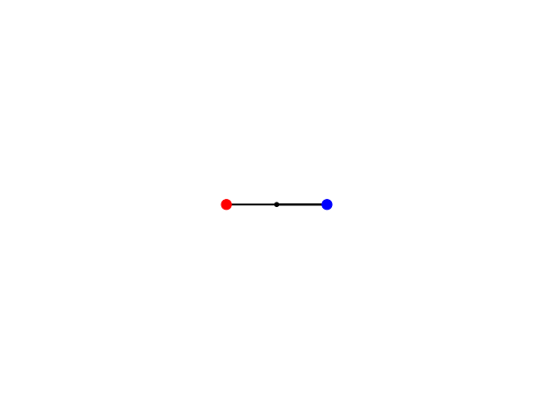

# AdaptiveControllerCpp
A Adaptive controller framework in C++

# Introduction
This code is a C++ solution for adaptive controller where masses of the double pendulum are unknown. It has custom implementation of the runge kutta integrator and also solves the lyapunov equation in C++. For visualization a python script is used. 
## Demo
Demo 1
- Starting angle: q1= pi/2 and q2= pi
- Desired Trajectory q1=pi+sin(t) and q2=2pi-cos(t)

# Adaptive Controller
The Adaptive controller uses the following Equations to solve:

credits:

# Lyapunov Function
I have used the following method to implement the lyapunov function. Follow the link
credits: https://people.kth.se/~eliasj/NLA/matrixeqs.pdf

# Pendulum Manipulator Equations:
   
## Getting Started

These instructions is to help you get started

### Prerequisites

- g++
- Python 3.x
- Numpy
- matplotlib

### How To Use
- make clean
- make
- ./AdaptiveController
- python plot_data.py

## Versioning
- 1.0
    - First Release
    - Next Release will add a interface and tuneable parameters

## Authors

* **Subhransu Mahapatra** 

 

